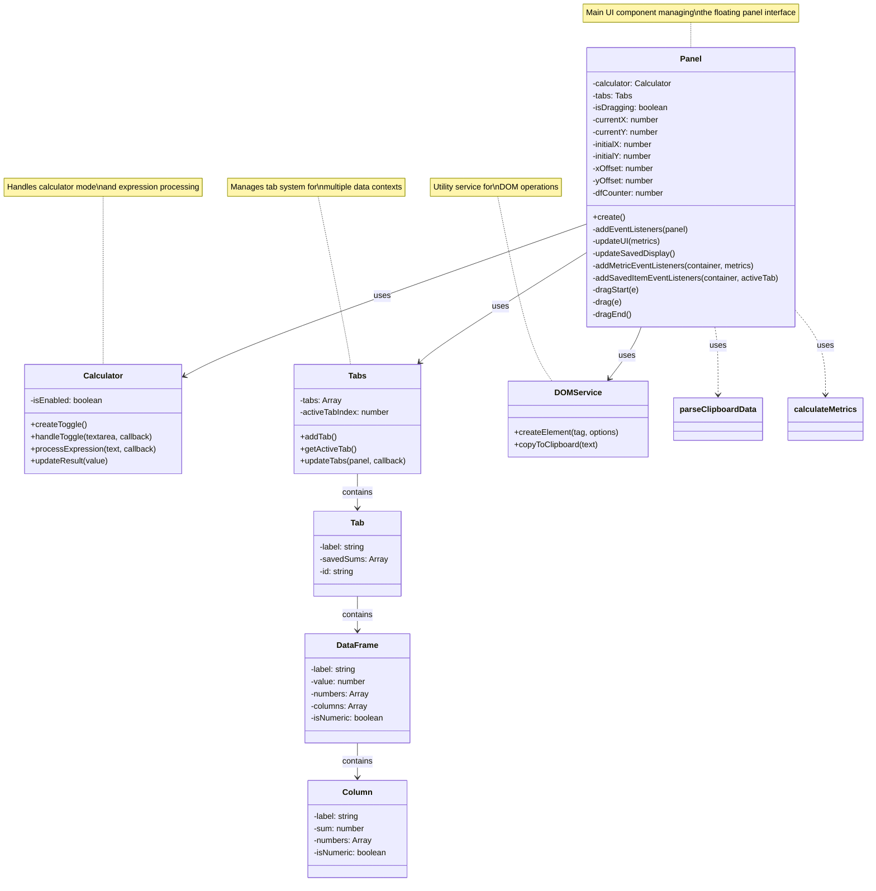

# DataFlash Component Flow

## File Structure References

### Core Components
- Panel: `src/js/components/Panel.js`
- Calculator: `src/js/components/Calculator.js`
- Tabs: `src/js/components/Tabs.js`
- DOMService: `src/js/services/domService.js`

### Utilities
- Data Processing: `src/js/utils/parser.js`
  - `parseClipboardData`
  - `calculateMetrics`

### Styles
- Component Styles: `src/js/styles/styles.js`
  - Panel styles
  - Button styles
  - Table styles
  - Animation styles

### Constants
- Configuration: `src/js/constants/config.js`
  - Icon URLs
  - Default values

## Component Interactions by File

### Panel.js (`src/js/components/Panel.js`)
- Creates main UI structure
- Manages event listeners
- Coordinates data flow
- Handles drag functionality
- Manages DataFrame operations

### Calculator.js (`src/js/components/Calculator.js`)
- Toggle calculator mode
- Process expressions
- Update results display

### Tabs.js (`src/js/components/Tabs.js`)
- Tab creation and management
- Tab state persistence
- Active tab tracking

### domService.js (`src/js/services/domService.js`)
- DOM element creation
- Clipboard operations
- UI updates

### parser.js (`src/js/utils/parser.js`)
- Data parsing logic
- Metrics calculation
- Number formatting

## Class Diagram



## Component Description

### Panel
The main UI component that manages the floating panel interface. It coordinates all other components and handles:
- User interactions
- Data display and updates
- Drag and drop functionality
- Event management

### Calculator
Handles calculator mode functionality including:
- Toggle calculator mode
- Process mathematical expressions
- Display results

### Tabs
Manages the tab system allowing:
- Multiple data contexts
- Tab creation and switching
- State management per tab

### DOMService
Utility service providing:
- DOM element creation
- Clipboard operations
- UI helper functions

### Utility Functions
- `parseClipboardData`: Processes pasted data
- `calculateMetrics`: Computes statistics and metrics 

## Data Flow and Storage

### Data Input Flow
1. User pastes data into textarea (`Panel.js`)
2. Textarea 'input' event triggers (`Panel.js: addEventListeners`)
3. If calculator mode is disabled:
   - Raw text is passed to `parseClipboardData` (`parser.js`)
   - Parsed data is passed to `calculateMetrics` (`parser.js`)
   - Metrics are passed to `updateUI` (`Panel.js`)

### Data Storage Structure

#### Tab Object (`src/js/components/Tabs.js`)
```javascript
{
    label: string,          // Tab name
    savedSums: DataFrame[], // Array of saved dataframes
    id: string             // Unique identifier
}
```

#### DataFrame Object (`src/js/components/Panel.js`)
```javascript
{
    label: string,         // DataFrame name (e.g., "df1")
    value: number,         // Total sum of all columns
    numbers: number[],     // All numbers flattened
    isNumeric: boolean,    // Whether data is numeric
    columns: Column[]      // Array of column objects
}
```

#### Column Object (`src/js/components/Panel.js`)
```javascript
{
    label: string,         // Column name
    sum: number,          // Sum of column values
    numbers: number[],    // Raw column values
    isNumeric: boolean    // Whether column is numeric
}
```

### Data Persistence Flow

1. **Initial Data Processing** (`src/js/utils/parser.js`)
   - Raw pasted data → `parseClipboardData` → Grouped data arrays
   - Grouped data → `calculateMetrics` → Metrics objects with sums and labels

2. **Saving Data** (`src/js/components/Panel.js: addMetricEventListeners`)
   - When "+" button is clicked:
   - New DataFrame object is created
   - Added to active tab's `savedSums` array
   - `dfCounter` is incremented
   - UI is updated via `updateSavedDisplay`

3. **Data Access** (`src/js/components/Panel.js`)
   - Active tab's data accessed via `getActiveTab()` (`Tabs.js`)
   - DataFrame operations (reload, delete) use array index
   - Column operations use both DataFrame and column indices

### Data Manipulation Features

1. **Reload Data** (`src/js/components/Panel.js: addSavedItemEventListeners`)
   - Creates temporary display of DataFrame
   - Maintains original data in `savedSums`
   - Allows horizontal scrolling and column viewing

2. **Statistics View** (`src/js/components/Panel.js: addSavedItemEventListeners`)
   - Calculates on-demand from column's `numbers` array
   - Shows null counts, empty values, sum, average, min, max
   - Temporary display, original data unchanged

3. **Copy Operations** (`src/js/services/domService.js`)
   - Can copy individual column values
   - Uses column's `numbers` array joined with newlines
   - Provides visual feedback via checkmark

### UI Updates

1. **DOM Creation** (`src/js/services/domService.js`)
   - createElement: Creates new DOM elements with attributes
   - Updates UI structure based on data changes

2. **Styling** (`src/js/styles/styles.js`)
   - Applies styles to all components
   - Handles animations and transitions
   - Manages responsive layout 